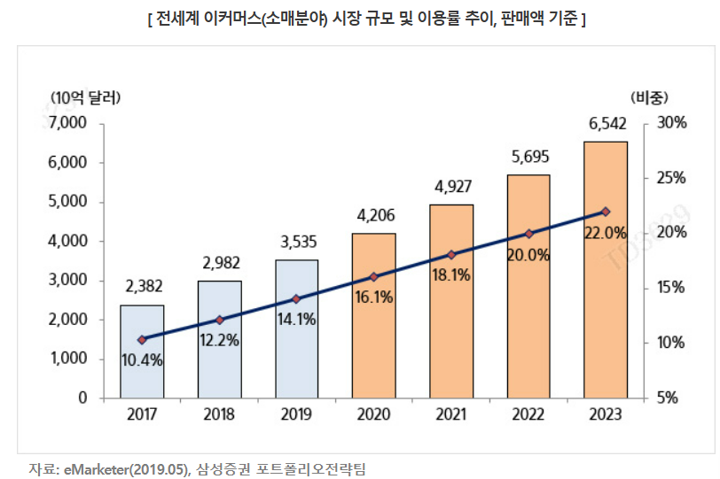
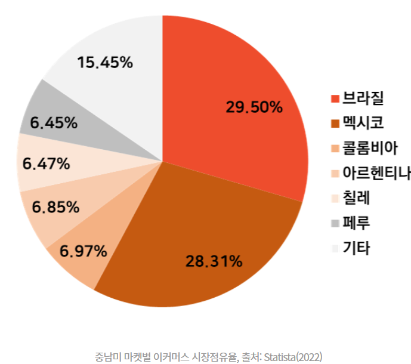
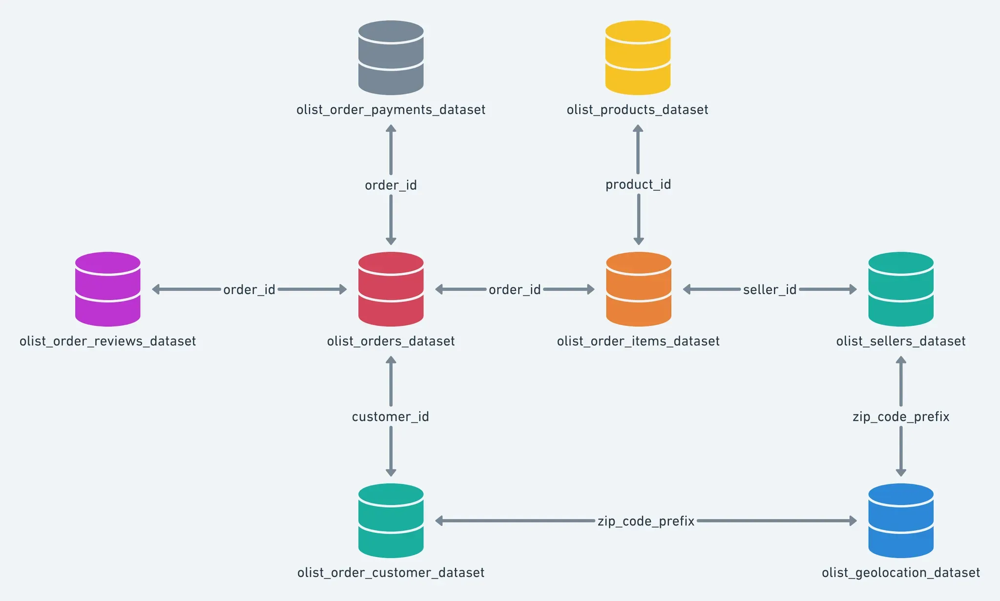
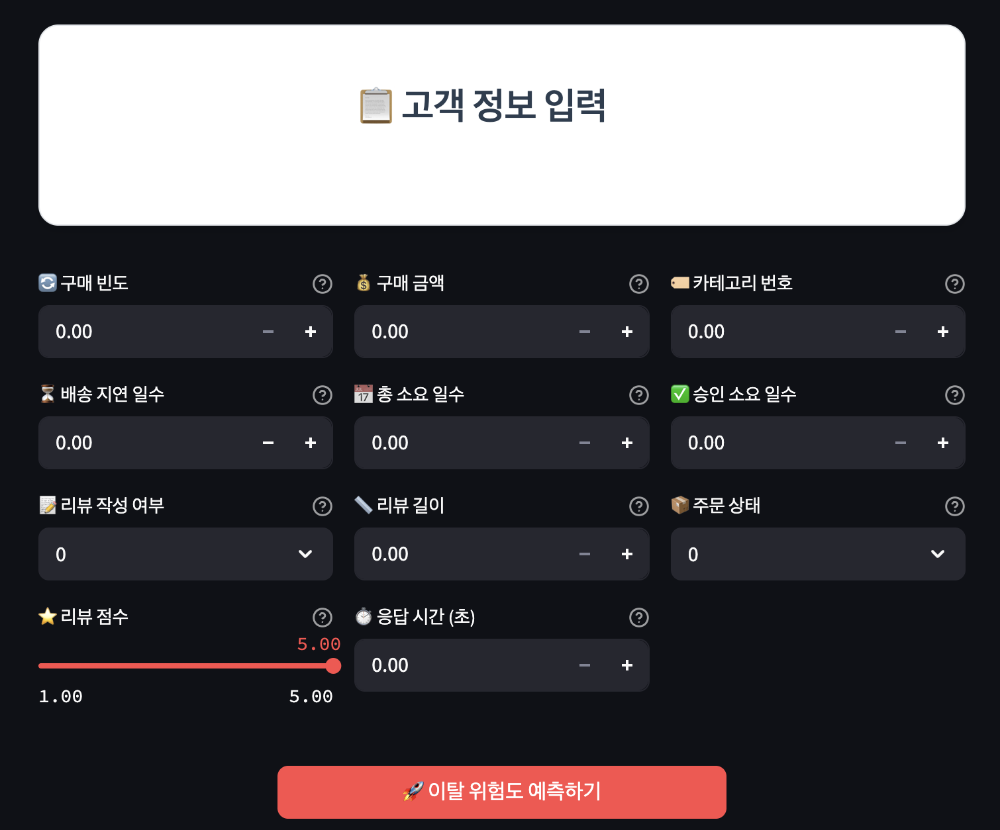
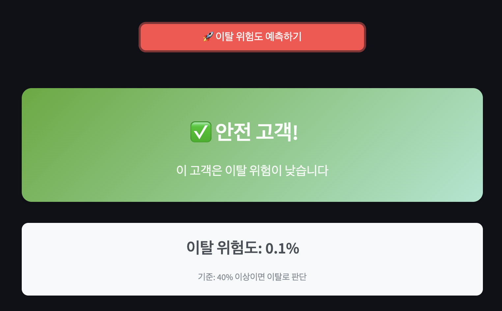
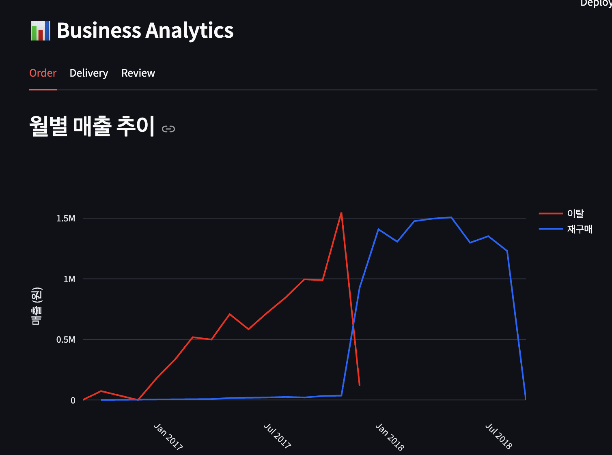
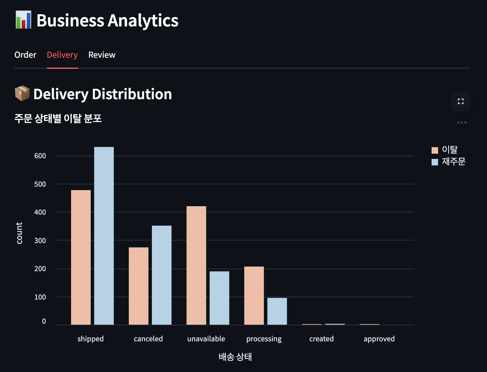
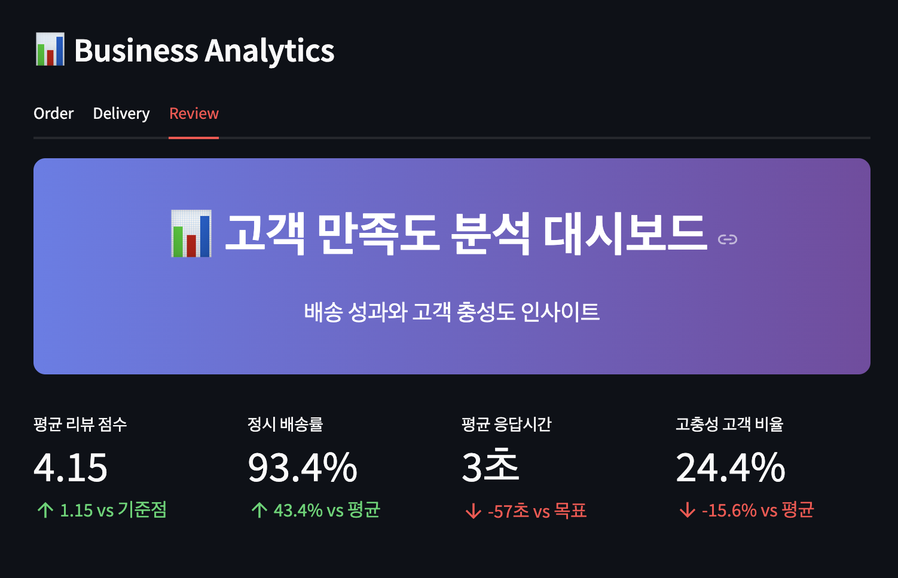
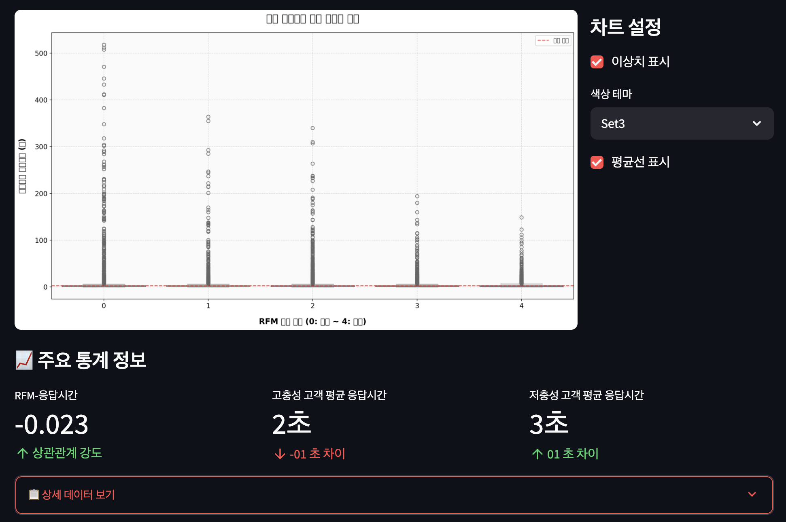

# **🧾 Olist 고객 이탈 예측 시스템**

Olist 사용자 이탈 예측 및 요인 분석

---

## **👨‍👩‍👧‍👦 팀 소개(5li5li)**

### **🧑‍💻 팀원소개 및 역할분담**

| 이름  | 역할 |
| --- | --- |
| 이수미 | EDA-LightGBM 및 전체 모델 학습, 최종모델 선정 |
| 전정규 | EDA-RandomForest 모델 학습, Streamlit(analytics 및 통합) |
| 이원지희 | EDA-XGBoost 모델 학습, PPT |
| 윤이서 | EDA-SVM 모델 학습, Streamlit(analytics-order) |
| 송유나 | EDA-LogisticRegressor 모델 학습, Streamlit(ananlytics-delivery) |

# **🖥️ 프로젝트**

---

### **📅 개발 기간**

- **2025.06.04 ~ 2025.06.05 (총 2일)**

### **🛒 프로젝트 주제**

    머신러닝을 활용한 Olist Store Online E-Commerce 고객 이탈 분석 및 예측

## **📌 1. 프로젝트 개요**

---

본 프로젝트는 브라질의 대표적인 이커머스 플랫폼 Olist의 공개 데이터를 활용하여 고객의 구매 행동 분석, 재구매 여부 예측, 그리고 이탈 가능성 탐지 등을 수행함으로써, 고객 관리 전략 수립에 기여하고자 진행되었습니다.

### 🇧🇷 **프로젝트 기획 배경**

**브라질**은 중남미 최대 소비 시장으로, 경제 회복 이후 소비 지출이 증가하고 이커머스 산업이 급성장 중이다. 해당 기사문에서 2016년 소비를 삶의 질 향상으로 인식하는 문화가 확산되며, 적극적인 소비 패턴이 두드러진다. 

*하지만 진입 장벽이 높은 시장 특성상, **고객 세분화 및 타겟팅 전략**이 기업 생존에 중요한 요소로 작용*

### **🔍 프로젝트 필요성**

> 이커머스 경쟁 심화로 인해 **기존 고객의 유지와 이탈 방지**가 핵심 과제로 떠오름,

데이터를 기반으로 고객 행동을 분석하고, 이탈 가능성을 사전에 예측하여 맞춤형 대응 전략을 수립할 필요가 있다!
> 

### **🎯 프로젝트 목표 및 기획**

- **1️⃣ 재구매 및 이탈 여부 정의**
    
    고객의 **재구매 및 이탈 여부**를 정의하고 **분류 기준**을 수립한다
    
- 2️⃣ **변수 생성 및 관계 분석**
    
    배송 및 제품 **속성**과 고객 **이탈** 간의 **관계를 분석**한다
    
- **3️⃣ RFM 분석**
    
    RFM 분석으로 고객을 유형화하고, 그에 따른 마케팅 전략 방향을 제시한다
    
- **4️⃣ 시각화 및 인사이트 도출**
    
    분석 결과를 시각화하고 대시보드 형태로 구현하여 **실행 가능한 인사이트를 도출**한다
    

## **📂 2. 데이터 소개**

---

- 브라질 E-Commerce 플랫폼 Olist의 약 10만 건 이상의 주문 데이터를 포함한 공개 데이터

**선정이유:**

다차원적인 데이터를 제공하며, 실제 고객 이탈 정보가 없어 가능성에 대해 연구할 수 있다

국내 전자상거래가 아닌 해외 전자상거래로서 글로벌 시장에 대한 새로운 인사이트를 얻는다 

**데이터 출처** https://www.kaggle.com/datasets/olistbr/brazilian-ecommerce

| 테이블명 | 설명 |
| --- | --- |
| `customers_dataset (99,441 x 5)`  | 고객 및 위치 정보(고객 ID, 우편번호) |
| `products_dataset (32,952 x 9)` | 판매된 상품 정보(상품명, 카테고리 등) |
| `sellers_dataset (3,095 x 4)` | 판매자 및 위치 정보(판매자 ID, 우편번호) |
| `orders_dataset (99,441 x 8)`  | 주문 기본 정보(주문 ID, 주문 상태, 구매일 등) |
| `order_payments_dataset (103,886 x 5)` | 주문 결제 정보(결제 유형, 결제 금액 등) |
| `order_reviews_dataset (99,224 x 7)` | 고객 리뷰 데이터(평점, 리뷰 내용 등) |
| `order_items_dataset (112,650 x 7)` | 주문별 상품 상세 정보(상품 ID, 수량, 가격 등) |
| `geolocation_dataset (999,999 x 5)` | 브라질 우편번호별 위도/경도 좌표 |
| `product_category_name (71 x 2)` | 상품  카테고리 포르투갈어 - 영문 |

## **🛠️ 3. 기술 스택**

---

- **언어**
    
    
    
- **데이터 분석**
    
    
    
    
    
- **머신러닝**
    
    
    
    
    
    
    
- **데이터 시각화**
    
    
    
    
    
- **데이터 균형화**
    
    
    
- **모델 해석**
    
    
    
- **개발 환경**
    
    
    
    
    
- **비전 관리**
    
    
    
    
    

## 🧪 4. EDA (탐색적 데이터 분석) 및 전처리

---

1. **데이터 전처리**
    - RFM 기반 이탈 고객 식별(churn)
    - payments 누락 컬럼 삭제 (1행)
    - 리뷰 점수 기반 작성 여부 컬럼 생성
    - 범주형 변수 One-hot encoding(review_flag, order_status_binary)
2. **데이터 불균형 처리**
    - Recency, Frequency, Monetary 스케일링
    - 학습 데이터와 테스트 데이터 분리(80:20)
3. **특성 표준화**
    - StandardScaler를 통한 수치형 데이터 정규화
4. **모델링 및 하이퍼파라미터 튜닝**
    - 로지스틱 회귀(LogisticRegression)
        - C, penalty, solver 파라미터 튜닝
    - 랜덤 포레스트(RandomForestClassifier)
        - n_estimators, max_depth, min_samples_split, max_features 파라미터 튜닝
    - XGBoost(XGBClassifier)
        - n_estimators, learning_rate, max_depth, subsample, colsample_bytree 파라미터 튜닝
    - LightGBM(LGBMClassifier)
        - num_leaves, learning_rate, n_estimators, feature_fraction 파라미터 튜닝
    - GridSearchCV를 통한 최적 파라미터 탐색
5. **모델 평가**
    - 정확도(Accuracy)
    - F1 점수(F1 Score)
    - 재현율(Recall)
    - 분류 보고서(Classification Report)
    - 혼동 행렬(Confusion Matrix)
    - ROC 곡선 및 AUC
6. **모델 해석**
    - 특성 중요도(Feature Importance) 분석
    - logarithmic loss (로그 손실)을 통한 모델 성능 평가
    - 시각화를 통한 결과 비교 분석

---

**주요 발견 사항**

- 구매자의 총 구매금액(Monetary)가 이탈 예측에 가장 중요한 지표로 확인되었습니다.
- XGBoost 모델이 F1 점수 0.75로 가장 높은 성능을 보였으며, 다른 모델들도 안정적인 성능을 보였습니다.
- 범주형 변수들(국가, 선호 장르, 선호 시청 시간대 등)을 Label Encoding하여 모델 성능을 향상시켰습니다.
- SMOTE를 통한 데이터 불균형 해소가 모델의 예측 성능 향상에 기여했습니다.
- 트리 기반 모델(RandomForest, XGBoost, LightGBM)이 로지스틱 회귀보다 약 5-8% 더 좋은 성능을 보였습니다.
- 30일 이상 로그인하지 않은 사용자를 이탈 고객으로 정의한 month_churn 특성이 모델 학습에 유용한 정보를 제공했습니다.

## 🤖 5. 머신러닝 모델링

---

**결과 및 성능**

모델 성능 비교 결과는 다음과 같습니다(final_df.ipynb 기준):

| **모델** | **정확도(Accuracy)** | 정밀도(Precision) | 재현율(Recall) | F1 Score | Best Parameters |
| --- | --- | --- | --- | --- | --- |
| XGBoost classifier | 0.7245 | 0.7402 | 0.7609 | 0.7504 | 'model__learning_rate': 0.1, 'model__max_depth': 5, 'model__n_estimators': 200 |
| LightGBM classifier | 0.7208 | 0.7411 | 0.7584 | 0.7496 | 'model__learning_rate': 0.1, 'model__max_depth': 5, 'model__n_estimators': 200 |
| RandomForest classifier | 0.7200 | 0.7350 | 0.7593 | 0.7469 | 'model__max_depth': 10, 'model__min_samples_split': 2, 'model__n_estimators': 200 |
| Logistic Regression | 0.6804 | 0.6601 | 0.8508 | 0.7434 | 'model__C': 1.0, 'model__penalty': 'l2', 'model__solver': 'saga’ |

**※ 정확한 수치는 final_df.ipynb 파일에서 확인 가능합니다.**

### **성능 결과 분석:**

- **XGBoost Classifier**
    
    > 종합 성능 가장 우수 (F1 Score: 0.7504)함**,**정밀도와 재현율 모두 균형 있게 높아, 전체적인 예측 성능이 가장 안정적 결론적으로 ****이탈 예측과 같이 정밀도와 재현율을 동시에 고려해야 하는 문제에 적합
    > 
- **LightGBM Classifier**
    
    > 정밀도 최고 (0.7411)**,**XGBoost와 유사한 수준의 재현율과 정확도를 보임
    F1 Score는 0.7496으로 거의 차이가 없지만, 정밀도를 더 중요시하는 경우 LightGBM도  좋은 선택
    > 
- **Random Forest Classifier**
    
    > XGBoost, LightGBM에 비해 약간 낮은 정밀도(0.7350)지만 재현율은 비슷합니다.,F1 Score도 0.7469로 경쟁력은 있지만, 약간 낮음.트리 기반 모델 중에서는 계산 속도와 해석 용이성을 고려해 적절한 대안이 될 수 있음.
    > 
- **Logistic Regression**
    
    > 가장 높은 재현율 (0.8508)이므로 이탈 고객을 놓치지 않도록 예측하는 데 강점이 있음.그러나 정밀도(0.6601)와 정확도(0.6804)가 낮아, 오탐지(실제는 이탈이 아닌 고객을 이탈로 예측)가 많을 수 있음.이탈 고객을 최대한 많이 포착해야 하는 경우 (보수적인 전략)에는 유용하지만, 마케팅 자원 낭비를 줄이기 위해 정밀도가 중요한 경우엔 비효율적일 수 있음.
    > 

### **특성 :**

| 변수명 | 설명 |
| --- | --- |
| `Frequency` | 고객의 전체 주문 횟수 |
| `Monetary` | 고객의 총 구매 금액 |
| `delay_days` | 배송 지연 일수 (실제 배송일 - 예상 배송일) |
| `total_days` | 주문일부터 배송까지의 전체 소요 일수 |
| `approval_days` | 주문일 → 배송 승인까지 걸린 일수 |
| `review_flag` | 리뷰 작성 여부 (1: 작성, 0: 미작성) |
| `review_length` | 리뷰 텍스트 길이 (문자 수 기준) |
| `review_score` | 고객이 남긴 리뷰 평점 (1~5점) |
| `response_time` | 고객 응답까지 소요된 평균 시간 |
| `order_status_binary` | 주문 상태 이진화 (1: 정상 완료, 0: 취소/환불 등 문제 주문) |
| `category_num` | 고객이 구매한 고유 카테고리 개수 |

### **각 모델별 특징:**

- **RandomForest**: 앙상블 학습을 통한 안정적인 성능과 높은 해석 가능성을 제공하여 본 프로젝트에서 최고 성능을 기록
- **LightGBM**: 리프 중심 트리 분할 방식으로 빠른 학습 속도와 메모리 효율성 제공
- **XGBoost**: 경사 부스팅 기반으로 높은 예측 정확도를 보이며, 과적합에 강한 특성을 보임
- **LogisticRegression**: 모델 구조가 단순하여 해석이 용이하나, 복잡한 패턴 학습에는 한계 존재

## 💭 6. Streamlit 구현

---

### 예측

### 분석

# 💡결론

---

### 주요 성과

- 4가지 머신러닝 모델(XGBoost, LGBM, Randomforest, logistic regressor)중 Accuracy 기준 XGBoost가 최고 성능(72.15%) 달성
- Olist 이커머스 데이터를 활용한 실제 비즈니스 환경 기반 모델 개발
- RFM 분석과 배송 데이터의 결합으로 의미 있는 예측 성능 확보
- 예측과 관련된 변수를 통해 이탈기준을 생성하여 프로세스를 통한 결과 도출

### 🙋🏻 문제 제기

- 2015년 설립 후 초기 2016~2018년 데이터로서 매출 안정화 이후의 데이터를 확보하여 데이터 불균형을 해소할 수 있을 것
- Churn 컬럼 생성 과정에서 주요 변수인 Recency를 활용함으로써 모델에 Recency 변수 활용 시 Target Leakage(데이터 누수)가 발생함 → Recency 외 변수를 사용하여 성능 향상 필요함

### **⚠️ 향후 개선 방향**

**1. 모델 성능 개선**

- 모델 앙상블 기법 적용→ LightGBM, XGBoost, CatBoost 등 다양한 모델을 결합해 정확도 향상
- 하이퍼파라미터 튜닝→ GridSearchCV, Optuna 등 활용하여 모델 최적화
- 클래스 불균형 처리→ SMOTE, 가중치 조정 등을 통해 이탈 고객의 데이터 불균형 대응

---

**2. UX 및 UI 개선**

- CSV 파일 업로드 기능 추가 → 예측 결과 및 분석 대시보드 실시간 반영
- 인터랙티브 분석 대시보드 구현 → 필터링 조건에 따른 데이터 시각화 제공
- UI 디자인 통일 및 컨셉 획일화 등 사용자 친화적 시각화를 목표

---

**🍏 한줄 회고**

- 이수미 : 이커머스 데이터 활용 경험을 쌓을 수 있어서 좋았습니다. 실제 회사의 데이터를 통해 비즈니스 분석을 수행하는 역량을 기를 수 있었습니다.
- 이원지희 : 이커머스데이터를 어떻게 분석하고 정제해야하는지 새롭게 알게되어 뜻깊은 프로젝트였습니다. 이커머스데이터로 많은 시행착오를 경험해보면서 성장한것같아 뿌듯했습니다. !!!
- 전정규 : 여러데이터를 다각도로 자세하게 분석해본게 큰 경험이 된것같습니다 팀원분들 모두 고생많으셨습니다.!
- 송유나 : 실데이터를 활용할 수 있는 기회와 더불어 함께 즐겁게 작업할 수 있는 좋은 기회였습니다! 배운것을 응용할 수 있는 좋은 기회!.. (˘•̥⧿•̥˘ )♡♡
- 윤이서 : 저의 부족한 부분을 채워주신 팀원분들께 감사할 따름입니다..(˘•̥⧿•̥˘ )♡♡